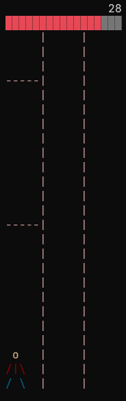
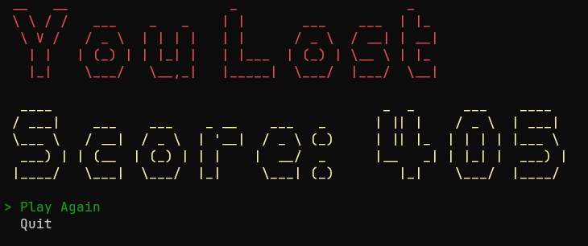

```
 _____                         ____           _     _                     _____   _   _   ___ 
|_   _|  _ __    ___    ___   / ___|  _   _  | |_  | |_    ___   _ __    |_   _| | | | | |_ _|
  | |   | '__|  / _ \  / _ \ | |     | | | | | __| | __|  / _ \ | '__|     | |   | | | |  | | 
  | |   | |    |  __/ |  __/ | |___  | |_| | | |_  | |_  |  __/ | |        | |   | |_| |  | | 
  |_|   |_|     \___|  \___|  \____|  \__,_|  \__|  \__|  \___| |_|        |_|    \___/  |___|
```

# TreeCutter TUI
TreeCutter TUI is a NativeAOT compatible C# console app version of the classic mobile game [Timberman](https://play.google.com/store/apps/details?id=com.dm.timber).
My main motivation for this project was to test out NativeAOT compilation. 

## Screenshots
<div>
    
    
</div>